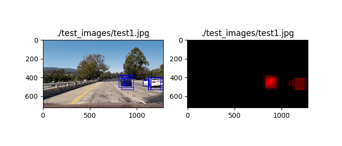
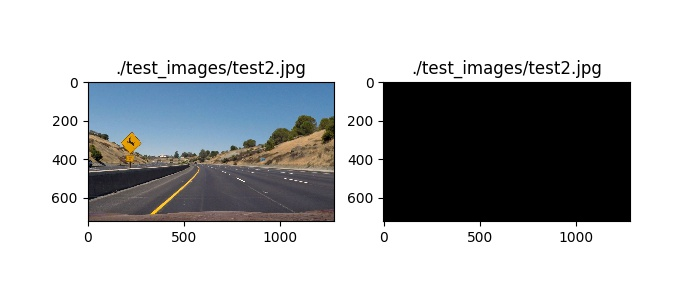
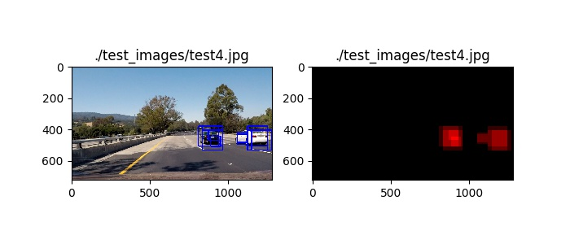
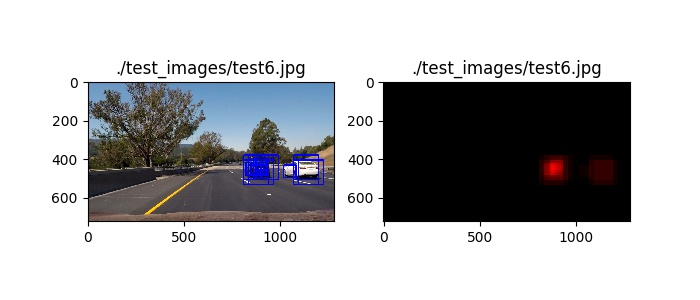
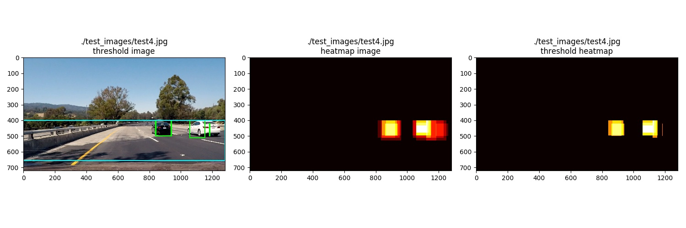
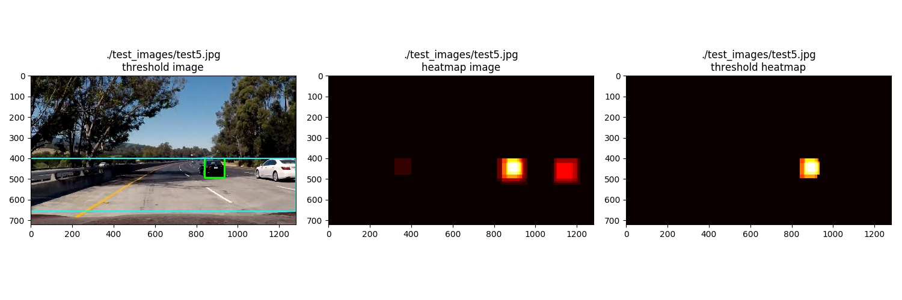
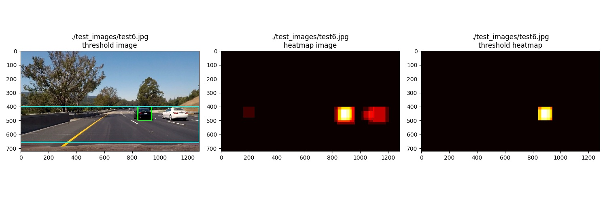

<!---
##Writeup Template
###You can use this file as a template for your writeup if you want to submit it as a markdown file, but feel free to use some other method and submit a pdf if you prefer.

---
-->
**Vehicle Detection Project**

The goals / steps of this project are the following&#58; 

* Perform a Histogram of Oriented Gradients (HOG) feature extraction on a labeled training set of images and train a classifier Linear SVM classifier
* Optionally, you can also apply a color transform and append binned color features, as well as histograms of color, to your HOG feature vector. 
* Note: for those first two steps don't forget to normalize your features and randomize a selection for training and testing.
* Implement a sliding-window technique and use your trained classifier to search for vehicles in images.
* Run your pipeline on a video stream (start with the test_video.mp4 and later implement on full project_video.mp4) and create a heat map of recurring detections frame by frame to reject outliers and follow detected vehicles.
* Estimate a bounding box for vehicles detected.

<!---
[//]: # (Image References)
[image1]: ./examples/car_not_car.png
[image2]: ./examples/HOG_example.jpg
[image3]: ./examples/sliding_windows.jpg
[image4]: ./examples/sliding_window.jpg
[image5]: ./examples/bboxes_and_heat.png
[image6]: ./examples/labels_map.png
[image7]: ./examples/output_bboxes.png
[video1]: ./project_video.mp4
-->

## [Rubric](https://review.udacity.com/#!/rubrics/513/view) Points

### Here I will consider the rubric points individually and describe how I addressed each point in my implementation.  

<!---

---
###Writeup / README

####1. Provide a Writeup / README that includes all the rubric points and how you addressed each one.  You can submit your writeup as markdown or pdf.  [Here](https://github.com/udacity/CarND-Vehicle-Detection/blob/master/writeup_template.md) is a template writeup for this project you can use as a guide and a starting point.  

You're reading it!

-->

### Histogram of Oriented Gradients (HOG)

#### 1. Explain how (and identify where in your code) you extracted HOG features from the training images.

The code for this step is contained in [`ShowHogFeatures.py`](./ShowHogFeatures.py) which uses the routine
[`get_hog_features.py`](./HogFeatures.py).

<!---
I started by reading in all the `vehicle` and `non-vehicle` images.  Here is an example of one of each of the `vehicle` and `non-vehicle` classes&#58;

![alt text][image1]
{:height="36px" width="36px"}
-->

I explored different color spaces and different
`skimage.hog()` parameters (`orientations`, `pixels_per_cell`, and `cells_per_block`).
I grabbed random images from each of the two classes and displayed them to get a feel for what the `skimage.hog()` output looks like.

Here is an example using the `HLS` color space and
HOG parameters of `orientations=8`, `pixels_per_cell=(8, 8)` and `cells_per_block=(2, 2)`&#58; 


#### 2. Explain how you settled on your final choice of HOG parameters.

I tried various combinations of parameters and, except for color space, settled on (more or less) the default parameters.
The HOG parameters used were save in [`FeatureVectorConfig.py`](./FeatureVectorConfig.py),
included here for reference:
```python
COLORSPACE = 'HLS' # Can be RGB, HSV, LUV, HLS, YUV, YCrCb
ORIENTATIONBINS = 9
PIXELSPERCELL = 8
CELLSPERBLOCK = 2
HOGCHANNEL = 'ALL' # Can be 0, 1, 2, or "ALL"
SPATIALSIZE = (16, 16) # Spatial binning dimensions
HISTOGRAMBINS = 16    # Number of histogram bins
SPATIALFEATURES = False # Spatial features on or off
HISTOGRAMFEATURES = False # Histogram features on or off
HOGFEATURES = True # HOG features on or off
```
As you can see from the parameters, I ignored the spatial and color features, even though they were coded up.

#### 3. Describe how (and identify where in your code) you trained a classifier using your selected HOG features (and color features if you used them).

I trained both a linear and an RBF support vector machine (SVM) in
[`BuildSvmClassifier.py`](./BuildSvmClassifier.py) using grid search&#58; 
```python
def svmGridSearch(X_train, y_train, theParameters):
    print("svmGridSearch-theParameters:", theParameters)
    svr = svm.SVC()
    gridSearchSvc = GridSearchCV(svr, theParameters, cv=CROSSVALIDATION)
    gridSearchSvc.fit(X_train, y_train)
    if True:
        print("svmGridSearch-Best parameters set found on development set:", gridSearchSvc.best_params_, ", best score:", gridSearchSvc.best_score_)
        print()
        print("svmGridSearch-Grid scores on development set:")
        print()
        means = gridSearchSvc.cv_results_['mean_test_score']
        stds = gridSearchSvc.cv_results_['std_test_score']
        for mean, std, params in zip(means, stds, gridSearchSvc.cv_results_['params']):
            print("%0.3f (+/-%0.03f) for %r"% (mean, std * 2, params))
    return gridSearchSvc
```
to tune the C parameter for the Linear SVM&#58; 
```python
0.984 (+/-0.008) for {'C': 0.0001, 'kernel': 'linear'}
0.986 (+/-0.004) for {'C': 0.0003, 'kernel': 'linear'}
0.985 (+/-0.005) for {'C': 0.0004, 'kernel': 'linear'}
0.985 (+/-0.004) for {'C': 0.0005, 'kernel': 'linear'}
```
and C and gamma for the RBF SVM&#58; 
```python
0.995 (+/-0.002) for {'gamma': 1.0000000000000001e-05, 'C': 1000.0, 'kernel': 'rbf'}
0.996 (+/-0.003) for {'gamma': 0.0001, 'C': 1000.0, 'kernel': 'rbf'}
0.865 (+/-0.008) for {'gamma': 0.001, 'C': 1000.0, 'kernel': 'rbf'}
0.995 (+/-0.002) for {'gamma': 1.0000000000000001e-05, 'C': 10000.0, 'kernel': 'rbf'}
0.996 (+/-0.003) for {'gamma': 0.0001, 'C': 10000.0, 'kernel': 'rbf'}
0.865 (+/-0.008) for {'gamma': 0.001, 'C': 10000.0, 'kernel': 'rbf'}
```
All of the considerable tuning of the hyperparameters is included in the comments in&#58; 
[`BuildSvmClassifier.py`](./BuildSvmClassifier.py).

The RBF classifier was stunning during training, but I was unable to get it to perform
properly on the video. Maybe I just didn&quot;t have enough time to tune the other window search parameters
in the code, since I spent a lot of time with the Linear SVM.

The SVM and the Scaler were saved by[`BuildSvmClassifier.py`](./BuildSvmClassifier.py)
using [`SaveAndRestoreClassifier.py`](./SaveAndRestoreClassifier.py),
so that the SVM models could be restored later, especially by [`ProcessVideo.py`](./ProcessVideo.py).

### Sliding Window Search

#### 1. Describe how (and identify where in your code) you implemented a sliding window search.
How did you decide what scales to search and how much to overlap windows?

I decided to search sequential window positions using sequential scales over
the test images using [`WindowSearch.py`](./WindowSearch.py).
The result of the window search on each of the test images:&#58;








The results of the search were incorporated into the window search parameters in [`ProcessVideo.py`](./ProcessVideo.py).

<!---

####2. Show some examples of test images to demonstrate how your pipeline is working.  What did you do to optimize the performance of your classifier?

Ultimately I searched on two scales using YCrCb 3-channel HOG features plus spatially binned color
and histograms of color in the feature vector, which provided a nice result.
Here are some example images:

![alt text][image4]
---
-->

### Video Implementation

#### 1. Provide a link to your final video output.

<!---

Your pipeline should perform reasonably well on the entire project video
(somewhat wobbly or unstable bounding boxes are ok as long as
you are identifying the vehicles most of the time with minimal false positives.)

-->

The
[video](http://www.autohandle.com/video/VehicleDetection.mp4)
has a blue box indicating the region of interest, green boxes showing the labels,
and yellow boxes indicating the merging and filtering of the labels from the heat map.

The video was created by:
[`ProcessVideo.py`](./ProcessVideo.py).

                                                                                                       
#### 2. Describe how (and identify where in your code) you implemented some kind of filter for false positives and some method for combining overlapping bounding boxes.


[`ProcessVideo.py`](./ProcessVideo.py)
calls `process_image`.

`process_image` calls `makeThresholdMap` in
[`FindCars.py`](./FindCars.py) which uses `find_cars`
to create a bounding box list using the svm classifer.
The bounding box list is filtered by the `svc.decision_function` value to (arbitrarily)
remove low quality classifications
(a suggestion from the grader).
``` python
test_prediction = svc.predict(test_features)
if test_prediction == 1:
    decision_function = svc.decision_function(test_features)
    if decision_function >= decisionFunctionThreshold:
```
The bounding box list as well as
the list of the `svc.decision_function` values is returned to `makeThresholdMap`
when processing each frame and then
passed to `addWeightedHeat` to create a heat map.
Instead of just incrementing the weight for each bounding box:
``` python
heatmap[box[0][1]:box[1][1], box[0][0]:box[1][0]] += 1 # all channels
```
`addWeightedHeat` increments the heat map based on the quality (`svc.decision_function`) of the
bounding box
``` python
weightedHeat=int(round(weight[0]*10))
heatmap[box[0][1]:box[1][1], box[0][0]:box[1][0]] += weightedHeat # all channels
```
The resulting heat maps for each frame are both maintained in a rolling fixed size stack
(a suggestion from the teaching mentor)
and totaled up by `totalHeatmapStack`. In addition, the heatmaps (and the heat counts) are "aged" using
the location of heatmap in the stack/queue (with the last, most recent, map receiving its full value):
``` python
for map in heatMapQueue:
    mapCount+=1
    mapWeight=float(mapCount)/float(heatMapQueueLength)
    totalMap+=(map*mapWeight) # sum
```
A fixed percent (`PERCENTOFBOUNDINGBOXESTOTOSS`)
of heat map counts is determined
``` python
unNormalizedHeatMapCounts=np.unique(unNormalizedHeatMap, return_counts=True)
unNormalizedHeatMapMidpoint=unNormalizedHeatMapCounts[0]
    [int(round(len(unNormalizedHeatMapCounts[0])*percentOfHeapmapToToss))]
```
and passed to `applyThreshold` to arbitrarily
delete (zero out) map entry counts from the lower end of the theshold heat map
``` python
thresholdMap[thresholdMap <= threshold] = 0
```
to create the final threshold map.

The heatmap is then normalized
``` python
maximumNormal=min(np.max(map), 255) # prevent sparse small values from being scaled up
normalizedMap = np.uint8(maximumNormal*map/np.max(map))
```
anticipating that `findLabels` will clip values above 255 later and i preferred that they be scaled
instead of clipped.

`process_image` then uses `drawLabelsOnImage` in
[`FindCars.py`](./FindCars.py) to first convert the threshold map into labels (a list of bounding boxes).
`process_image` then uses `processLabelBoundingBoxes` to filter the label bounding boxes to try and remove false positives using a frame history of previously discovered bounding boxes.
`processLabelBoundingBoxes` maintains a rolling list of all label bounding boxes (`labelBoundingBoxCollection`)
found in each historic frame. The number of frames maintained is set by the `BOUNDINDBOXCOLLECTIONSIZE`.
The list of label bounding boxes is compared to prior frames to create a list of bounding boxes that
are overlapping ([`isBoundingBoxOverlapping`](./FindCars.py)).
The length of the overlapping list is used to decide (`OVERLAPTHRESHOLD`) which label bounding boxes
are a positve hit for a vehicle. The list of bounding boxes is combined in `mergeBoundingBoxesAcrossFrames` in 
[`ProcessVideo.py`](./ProcessVideo.py).

<!---

I recorded the positions of positive detections in each frame of the video.
From the positive detections I created a heatmap and then thresholded that map to identify vehicle positions.
I then used `scipy.ndimage.measurements.label()` to identify individual blobs in the heatmap.
I then assumed each blob corresponded to a vehicle.
I constructed bounding boxes to cover the area of each blob detected.  

Here&quot;s an example result showing the heatmap from a series of frames of video,
the result of `scipy.ndimage.measurements.label()`
and the bounding boxes then overlaid on the last frame of video:
-->

Here are six frames, their corresponding heat maps, and their threshold maps&#58;






The images were created in:
[`ShowFindCars.py`](./ShowFindCars.py)

The output of `scipy.ndimage.measurements.label()` on the integrated heatmap
and the resulting bounding boxes are drawn onto each frame in the video&#58;
[video](http://www.autohandle.com/video/VehicleDetection.mp4). The video also has a blue box
indicating the region of interest and green boxes showing the labels.
In addition, yellow boxes indicate the merging and filtering of the labels from the heat/threshold map(s).

---

### Discussion

#### 1. Briefly discuss any problems / issues you faced in your implementation of this project.
<!---
Where will your pipeline likely fail?
What could you do to make it more robust?
-->

Here I'll talk about the approach I took, what techniques I used, what worked and why, where the pipeline might fail and how I might improve it if I were going to pursue this project further.

Initially, I only used the HOG features and I only trained on 5000 samples.
I only used HOG because I considered the spatial and color features a be form of  well, overfitting.
I only used a subset of the training samples to speed up the learning cycle.

The resulting classifier tended to find cars from the railing along the left hand side of the road,
as well as, if you will, ghost cars in the pavement.
The grader suggested using the `svc.decision_function` as a filter, which I did,
but the `svc.decision_function` only slightly improved performance: it removed some of the ghost cars.
In desperation, I added the spatial and color features, but again,
this only slightly improved performance here and there.
The teaching mentor suggested using a rolling heatmap, which I then did,
and in combination with the grader's suggestion to use the `svc.decision_function`,
I created a weighted rolling heatmap with aging.
This, finally, started to improve the performance, but still, it seemd substandard (and ad-hoc).

While I was thinking about creating negative samples of the railing for training  
I rebuilt the classifier using all of the samples available  
which took a while (my laptop is still cooling off).
This had a big effect and I got the performance I have now with just a few false positives.
It would be interesting to now go back and start removing the other coding features
that I added to observe the effect.
